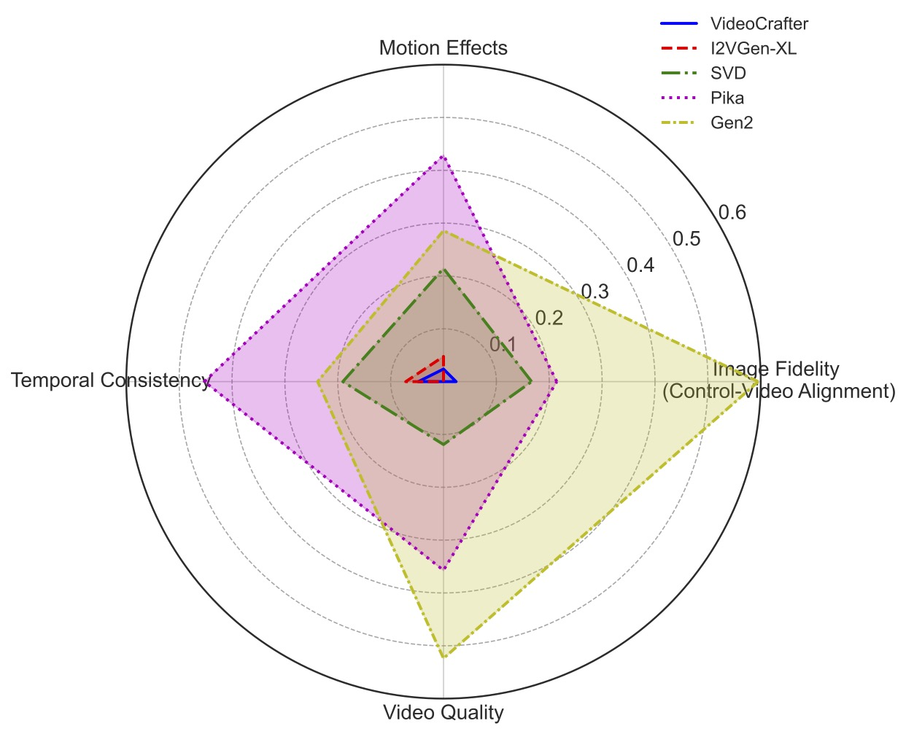

# AIGCBench

:dart::dart: AIGCBench is a novel and comprehensive benchmark designed for evaluating the capabilities of state-of-the-art video generation algorithms. Official code for the paper:

> **AIGCBench: Comprehensive Evaluation of Image-to-Video Content Generated by AI**, ***BenchCouncil Transactions on Benchmarks, Standards and Evaluations (TBench)***.
>
> Fanda Fan, Chunjie Luo, Wanling Gao, Jianfeng Zhan
>
> <a href='https://arxiv.org/abs/2401.01651'></a> <a href='https://www.benchcouncil.org/AIGCBench/'></a> <a href='https://github.com/BenchCouncil/AIGCBench'></a>

<p align="center">
  
</p>

<em>Illustration of our AIGCBench. Our AIGCBench is divided into three modules: the evaluation dataset, the evaluation metrics, and the video generation models to be assessed.</em>


Key Features of AIGCBench:
- Diverse Datasets: AIGCBench incorporates a variety of datasets, including real-world video-text pairs and image-text pairs, to ensure a broad and realistic evaluation spectrum. Additionally, it includes a newly generated dataset created through an innovative text-to-image generation pipeline, enhancing the diversity and representativeness of the benchmark.
- Extensive Evaluation Metrics: AIGCBench introduces a set of evaluation metrics that cover four crucial dimensions of video generation—**control-video alignment**, **motion effects**, **temporal consistency**, and **video quality**. Our evaluation metrics encompass both reference **video-based metrics** and **video-free metrics**.
- Validated by Human Judgment: The benchmark's evaluation criteria are thoroughly verified against human preferences to confirm their reliability and alignment with human judgments.
- In-Depth Analysis: Through extensive evaluations, AIGCBench reveals insightful findings about the current strengths and limitations of existing I2V models, offering valuable guidance for future advancements in the field.
- Future Expansion: AIGCBench is not only comprehensive and scalable in its current form but also designed with the vision to encompass a wider range of video generation tasks in the future. This will allow for a unified and in-depth benchmarking of various aspects of AI-generated content (AIGC), setting a new standard for the evaluation of video generation technologies.

## :fire:News
- [01/24/2024] Our paper has been accepted by BenchCouncil Transactions on Benchmarks, Standards and Evaluations (Tbench)!
- [01/10/2024] The evaluation dataset and evaluation code have been released.

## Dataset

:smile:The [Hugging Face link](https://huggingface.co/datasets/stevenfan/AIGCBench_v1.0) for our dataset.

This dataset is intended for the evaluation of video generation tasks. Our dataset includes image-text pairs and video-text pairs. The dataset comprises three parts:
1. `Ours` - A custom generation of image-text samples.
2. `Webvid val` - A subset of 1000 video samples from the WebVid val dataset.
3. `Laion-aesthetics` - A subset of LAION dataset that includes 925 curated image-text samples.

Below are some images we generated, with the corresponding text:
| Image            | Description      |
|------------------|------------------|
|  | *Amidst the lush canopy of a deep jungle, a playful panda is brewing a potion, captured with the stark realism of a photo.* |
|    | *Behold a noble king in the throes of skillfully strumming the guitar surrounded by the tranquil waters of a serene lake, envisioned in the style of an oil painting.* |
|   | *Amidst a sun-dappled forest, a mischievous fairy is carefully repairing a broken robot, captured in the style of an oil painting.* |
|   | *Within the realm of the backdrop of an alien planet's red skies, a treasure-seeking pirate cleverly solving a puzzle, each moment immortalized in the style of an oil painting.* |


## Metrics

We have encapsulated the evaluation metrics used in our paper in `eval.py`; for more details, please refer to the paper. To use the code, please first download the [clip model](https://openaipublic.azureedge.net/clip/models/b8cca3fd41ae0c99ba7e8951adf17d267cdb84cd88be6f7c2e0eca1737a03836/ViT-L-14.pt) file and replace the 'path_to_dir' with the actual path.

Below is a simple example:
```python
batch_video_path = os.path.join('path_to_videos', '*.mp4')
video_path_list = sorted(glob.glob(batch_video_path))

sum_res = 0
cnt = 0
for video_path in video_path_list:
    res = compute_video_video_similarity(ref_video_path, video_path)
    sum_res += res['clip']
    cnt += res["state"]
print(sum_res / cnt)
```

## Evaluation Results

Quantitative analysis for different Image-to-Video algorithms. An upward arrow indicates that higher values are better, while a downward arrow means lower values are preferable.
| Dimensions | Metrics | VideoCrafter | I2VGen-XL | SVD | Pika | Gen2 |
|------------|---------|------------------|---------------|---------|----------|----------|
| Control-video Alignment | MSE (First) ↓ | 3929.65 | 4491.90 | 640.75 | **155.30** | 235.53 |
| | SSIM (First) ↑ | 0.300 | 0.354 | 0.612 | 0.800 | **0.803** |
| | Image-GenVideo Clip ↑ | 0.830 | 0.832 | 0.919 | 0.930 | **0.939** |
| | GenVideo-Text Clip ↑ | 0.23 | 0.24 | - | **0.271** | 0.270 |
| | GenVideo-RefVideo CliP (Keyframes) ↑ | 0.763 | 0.764 | - | **0.824** | 0.820 |
| Motion Effects | Flow-Square-Mean | 1.24 | 1.80 | 2.52 | 0.281 | 1.18 |
| | GenVideo-RefVideo CliP (Corresponding frames) ↑ | 0.764 | 0.764 | 0.796 | **0.823** | 0.818 |
| Temporal Consistency | GenVideo Clip (Adjacent frames) ↑ | 0.980 | 0.971 | 0.974 | **0.996** | 0.995 |
| | GenVideo-RefVideo CliP (Corresponding frames) ↑ | 0.764 | 0.764 | 0.796 | **0.823** | 0.818 |
| Video Quality | Frame Count ↑ | 16 | 32 | 25 | 72 | **96** |
| | DOVER ↑ | 0.518 | 0.510 | 0.623 | 0.715 | **0.775** |
| | GenVideo-RefVideo SSIM ↑ | 0.367 | 0.304 | 0.507 | **0.560** | 0.504 |

To validate the alignment of our proposed evaluation standards with human preferences, we conducted a study. We randomly selected 30 generated results from each of the five methods. Then, we asked participants to vote on the best algorithm outcomes across four dimensions: Image Fidelity, Motion Effects, Temporal Consistency, and Video Quality. A total of 42 individuals participated in the voting process. The specific results of the study are presented below:



## Contact Us

:email: If you have any questions, please feel free to contact us via email at fanfanda@ict.ac.cn and jianfengzhan.benchcouncil@gmail.com.


## Citation

If you find our work useful in your research, please consider citing our paper:

```bibtex
@misc{fan2024aigcbench,
      title={AIGCBench: Comprehensive Evaluation of Image-to-Video Content Generated by AI}, 
      author={Fanda Fan and Chunjie Luo and Wanling Gao and Jianfeng Zhan},
      year={2024},
      eprint={2401.01651},
      archivePrefix={arXiv},
      primaryClass={cs.CV}
}
```
